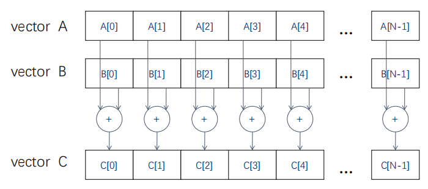
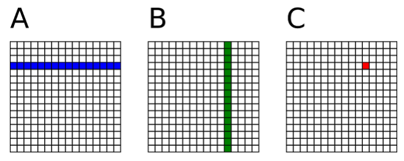
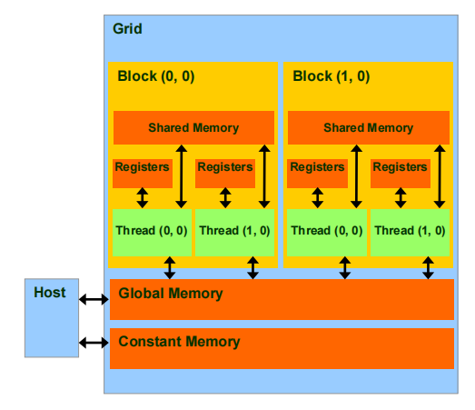

# 第二章 矩阵乘法

## 并行计算实例：向量相加



```c
// Device Code
// Compute vector sum C = A + B
// Each thread performs one pair-wise addition
__global__
void vecAddKernel(float* A_d, float* B_d, float* C_d, int n)
{
    int i = threadIdx.x + blockDim.x * blockIdx.x;
    if (i<n) C_d[i] = A_d[i] + B_d[i];
}

// Host Code
int vecAdd(float* A, float* B, float* C, int n)
{
    // A_d, B_d, C_d allocations and copies omitted
    // Run ceil (n/256) blocks of 256 threads each
    vecAddKernel<<<ceil(n/256), 256>>>(A_d, B_d, C_d, n);
}
```


## 矩阵乘法

- `C = A * B (A[m, k], B[k, n], C[m, n])`

- 一个线程负责计算C中的一个元素

- A中的每一行从全局内存中载入N次

- B中的每一列从全局内存中载入M次

- `C=AB([m*k], [k*n])`的矩阵乘法运算，每个线程都有读取A的一整行和B的一整列。A矩阵中的每个点需要被读取N次，B矩阵中的每个点需要被读M次。

- 可以将多次访问的数据放到共享内存中，减少重复读取的次数，并充分利用共享内存的延迟低的优势。

  

- ```c
  // Matrix multiplication on the (CPU) host
  void main()
  {
      define A, B, C
      for i = 0 to M-1 do
          for j = 0 to N-1 do
              /* compute element C(i,j) */
              for k = 0 to K-1 do
                  C(i,j) <= C(i,j) + A(i,k) * B(k,j)
              end
          end
      end
  }
  ```

- ```c
  __global__ void matrixMul(A_gpu, B_gpu, C_gpu, K)
  {
      temp <= 0
          
      i <= blockIdx.y * blockDim.y + threadIdx.y		// Row i of matrix C
      j <= blockIdx.x * blockDim.x + threadIdx.x		// Column j of matrix C
          
      for k = 0 to K-1 do
          accu <= accu + A_gpu(i,k) * B_gpu(k,j)
      end
      
      C_gpu(i,j) <= accu
  }
  
  void main()
  {
      define A_cpu, B_cpu, C_cpu in the CPU memory
      define A_gpu, B_gpu, C_gpu in the GPU memory
      
      memcopy A_cpu to A_gpu
      memcopy B_cpu to B_gpu
          
      dim3 dimBlock(16, 16)
      dim3 dimGrid(N/dimBlock.x, M/dimBlock.y)
      
      matrixMul<<<dimGrid, dimBlock>>>(A_gpu, B_gpu, C_gpu, K)
      
      memcopy C_gpu to C_cpu
  }
  ```

  

## CUDA内存读写速度

- 每个线程读写速度对比：
  - 各自线程寄存器（~1周期）
  - 线程块共享内存（~5周期）
  - Grid全局内存（~500周期）
  - Grid常量内存（~5周期）



## CUDA中的共享内存

- 一种特殊类型的内存，其内容在源代码中被显式声明和使用
  - 位于处理器中
  - 以更高的速度访问（延迟&吞吐）
  - 仍然被内存访问指令访问
  - 在计算机体系结构中通常被称为暂存存储器
- 共享内存特点
  - 读取速度等同于缓存，在很多显卡上，缓存和共享内存使用的是同一块硬件，并且可配置大小
  - 共享内存属于线程块，可以被一个线程块内的所有线程访问
  - 共享内存的两种申请空间方式，静态申请和动态申请
  - 共享内存的大小只有几十K，过度使用共享内存会降低程序的并行性

### CUDA中的共享内存使用方法

1. 申请
   - `__shared__`关键字
   - 静态申请
   - 动态申请
2. 使用
   - 将每个线程从全局索引位置读取元素，将它存储到共享内存之中。
   - 注意数据存在着交叉，应该将边界上的数据拷贝进来。
   - 块内线程同步：`__syncthreads()`。