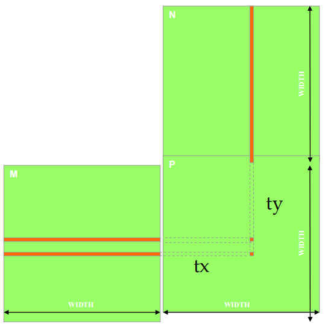

# 第二章 矩阵乘法

## 并行计算实例：向量相加


```c
// Device Code
// Compute vector sum C = A + B
// Each thread performs one pair-wise addition
__global__
void vecAddKernel(float* A_d, float* B_d, float* C_d, int n)
{
    int i = threadIdx.x + blockDim.x * blockIdx.x;
    if (i<n) C_d[i] = A_d[i] + B_d[i];
}

// Host Code
int vecAdd(float* A, float* B, float* C, int n)
{
    // A_d, B_d, C_d allocations and copies omitted
    // Run ceil (n/256) blocks of 256 threads each
    vecAddKernel<<<ceil(n/256), 256>>>(A_d, B_d, C_d, n);
}
```


## 矩阵乘法

- `C = A * B (A[m, k], B[k, n], C[m, n])`

- 一个线程负责计算C中的一个元素

- A中的每一行从全局内存中载入N次

- B中的每一列从全局内存中载入M次

- `C=AB([m*k], [k*n])`的矩阵乘法运算，每个线程都有读取A的一整行和B的一整列。A矩阵中的每个点需要被读取N次，B矩阵中的每个点需要被读M次。

- 可以将多次访问的数据放到共享内存中，减少重复读取的次数，并充分利用共享内存的延迟低的优势。

  

- ```c
  // Matrix multiplication on the (CPU) host
  void main()
  {
      define A, B, C
      for i = 0 to M-1 do
          for j = 0 to N-1 do
              /* compute element C(i,j) */
              for k = 0 to K-1 do
                  C(i,j) <= C(i,j) + A(i,k) * B(k,j)
              end
          end
      end
  }
  ```

- ```c
  __global__ void matrixMul(A_gpu, B_gpu, C_gpu, K)
  {
      temp <= 0
          
      i <= blockIdx.y * blockDim.y + threadIdx.y		// Row i of matrix C
      j <= blockIdx.x * blockDim.x + threadIdx.x		// Column j of matrix C
          
      for k = 0 to K-1 do
          accu <= accu + A_gpu(i,k) * B_gpu(k,j)
      end
      
      C_gpu(i,j) <= accu
  }
  
  void main()
  {
      define A_cpu, B_cpu, C_cpu in the CPU memory
      define A_gpu, B_gpu, C_gpu in the GPU memory
      
      memcopy A_cpu to A_gpu
      memcopy B_cpu to B_gpu
          
      dim3 dimBlock(16, 16)
      dim3 dimGrid(N/dimBlock.x, M/dimBlock.y)
      
      matrixMul<<<dimGrid, dimBlock>>>(A_gpu, B_gpu, C_gpu, K)
      
      memcopy C_gpu to C_cpu
  }
  ```

  

## CUDA内存读写速度

- 每个线程读写速度对比：
  - 各自线程寄存器（~1周期）
  - 线程块共享内存（~5周期）
  - Grid全局内存（~500周期）
  - Grid常量内存（~5周期）


## CUDA中的共享内存

- 一种特殊类型的内存，其内容在源代码中被显式声明和使用
  - 位于处理器中
  - 以更高的速度访问（延迟&吞吐）
  - 仍然被内存访问指令访问
  - 在计算机体系结构中通常被称为暂存存储器
- 共享内存特点
  - 读取速度等同于缓存，在很多显卡上，缓存和共享内存使用的是同一块硬件，并且可配置大小
  - 共享内存属于线程块，可以被一个线程块内的所有线程访问
  - 共享内存的两种申请空间方式，静态申请和动态申请
  - 共享内存的大小只有几十K，过度使用共享内存会降低程序的并行性

### CUDA中的共享内存使用方法

1. 申请
   - `__shared__`关键字
   - 静态申请
   - 动态申请

2. 使用
   - 将每个线程从全局索引位置读取元素，将它存储到共享内存之中。
   - 注意数据存在着交叉，应该将边界上的数据拷贝进来。
   - 块内线程同步：`__syncthreads()`。

3. `__syncthreads()`线程同步函数使用方法

   - `__syncthreads()`是cuda的内建函数，用于块内线程通信

   - 可以到达`__syncthreads()`的线程同步，而不是等待块内所有其他线程再同步

   - ```c
     __share__ val[];
     if(index < n)
     {
         if(tid condition)
         {
             do something with val;
         }
         __syncthreads();
         do something with val;
         __syncthreads();
     }
     ```

   - ```c
     __share__ val[];
     if(index < n)
     {
         if(tid condition)
         {
             do something with val;
             __syncthreads();
         }
         else
         {
             do something with val;
             __syncthreads();
         }
     }
     ```

4. 申请共享内存的两种方式：静态方式

   - 共享内存大小明确：

   - ```c
     __global__ void staticReverse(int *d, int n)
     {
         __shared__ int s[64];
         int t = threadIdx.x;
         int tr = n-t-1;
         s[t] = d[t];
         __syncthreads();
         d[t] = s[tr];
     }
     staticReverse<<<1, n>>>(d_d, n);
     ```

5. 申请共享内存的两种方式：动态方式

   - 共享内存大小不明确：

   - ```c
     __global__ void dynamicReverse(int *d, int n)
     {
         extern __shared__ int s[];
         int t = threadIdx.x;
         int tr = n-t-1;
         s[t] = d[t];
         __syncthreads();
         d[t] = s[tr];
     }
     dynamicReverse<<<1, n, n*sizeof(int)>>>(d_d, n);
     ```

6. 思路：使用共享内存复用全局内存数据
   - 每个输入元素被WIDTH个线程读取
   - 将每个元素加载到共享内存中并让多个线程使用本地版本以减少内存带宽
   - 

## 平铺矩阵乘法

- 将内核的执行分解为多个阶段，使每个阶段的数据访问集中在一个子集上(tile) of Md and Nd


- 平铺矩阵同步
  - CUDA中同步的API
    - `__syncthreads()`
  - 同一线程块中所有线程必须到达运行`__syncthreads()`之后才可以做其余操作
  - 最适合用于协调平铺算法
    - 确保加载平铺矩阵块中的所有元素
    - 确保平铺矩阵块中的所有元素都被使用

- 平铺矩阵读取
  - 第一个平铺矩阵元素
    - `M[Row][tx]`
    - `N[ty][Col]`
  - 下一个平铺矩阵元素
    - `M[Row][1*TILE_WIDTH+tx]`
    - `N[1*TILE_WIDTH_ty][Col]`

- 平铺矩阵乘法核函数

```c
__global__ void matrixMul(A_gpu, B_gpu, C_gpu, K)
{
    __shared__ float A_tile(blockDim.y, blockDim.x)
    __shared__ float B_tile(blockDim.x, blockDim.y)
    
    accu <= 0
    
    // core part /* Accumulate C tile by tile. */
        
    // Row i of matrix C
    i <= blockIdx.y * blockDim.y + threadIdx.y
    // Column j of matrix C
    j <= blockIdx.x * blockDim.x + threadIdx.x
    // Store accumulated value to C(i,j)
    C_gpu(i,j) <= accu
}
```

- 平铺矩阵乘法核函数（伪代码）

```pseudocode
/* Accumulate C tile by tile. */
for tileIdx = 0 to (K/blockDim.x - 1) do
    /* Load one tile of A and one tile of B into shared mem */
    i <= blockIdx.y * blockDim.y + threadIdx.y // Row i of matrix A
    j <= tileIdx.x * blockDim.x + threadIdx.x // Column j of matrix A
    A_tile(threadIdx.y, threadIdx.x) <= A_gpu(i,j) // Load A(i,j) to shared mem
    B_tile(threadIdx.x, threadIdx.y) <= B_gpu(j,i) // Load B(j,i) to shared mem
    __sync() // Synchronize before computation
    
    /* Accumulate one tile of C from tiles of A and B in shared mem */
    for k = 0 to threadDim.x do
    	accu <= accu + A_tile(threadIdx.y, k) * B_tile(k, threadIdx.x)
    end
    __sync()
end
```

- 时间对比

|                 | 64 * 64 | 512 * 512 |
| --------------- | ------- | --------- |
| CPU             |         |           |
| GPU ori (P40)   |         |           |
| GPU tiled (P40) |         |           |

